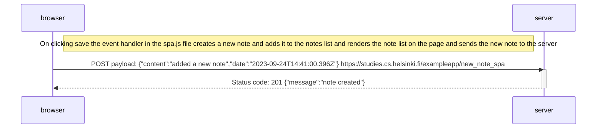

```mermaid
    sequenceDiagram
    
    participant browser
    participant server

    Note right of browser: On clicking save the event handler in the spa.js file creates a new note and adds it to the notes list and renders the note list on the page and sends the new note to the server

    browser->>server: POST payload: {"content":"added a new note","date":"2023-09-24T14:41:00.396Z"} https://studies.cs.helsinki.fi/exampleapp/new_note_spa
    activate server
    server-->>browser: Status code: 201 {"message":"note created"}
    deactivate server


```